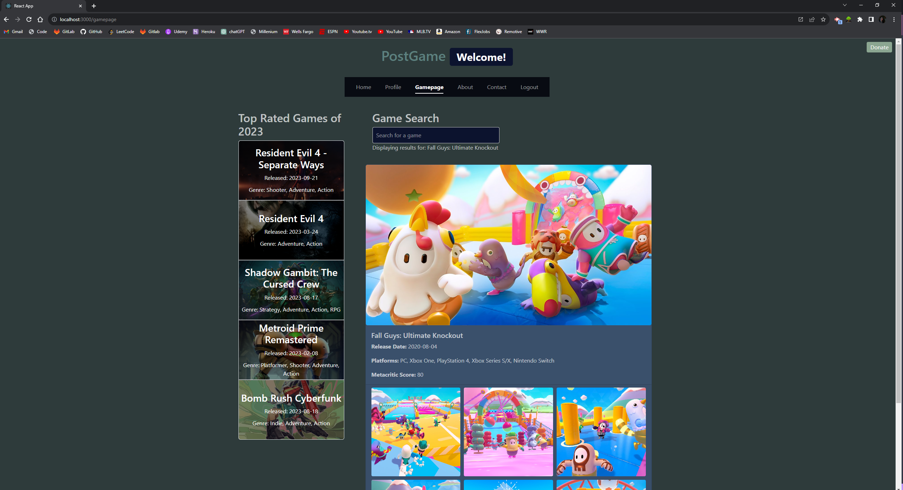
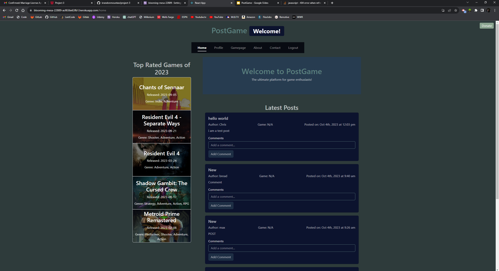
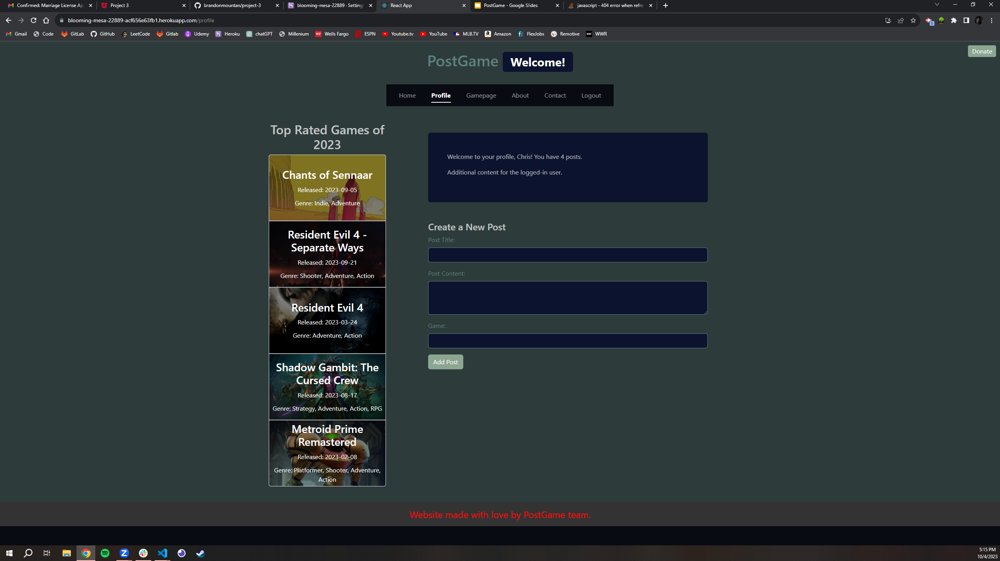
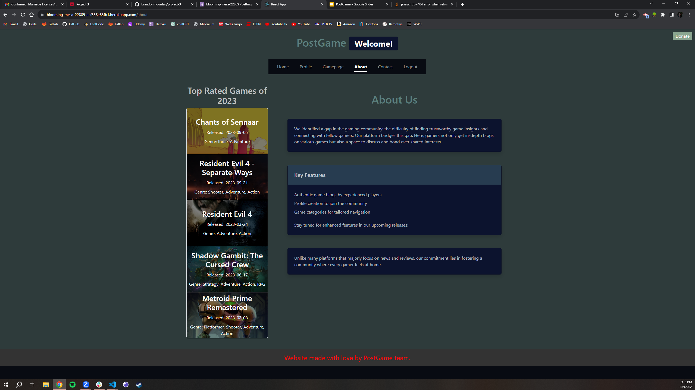
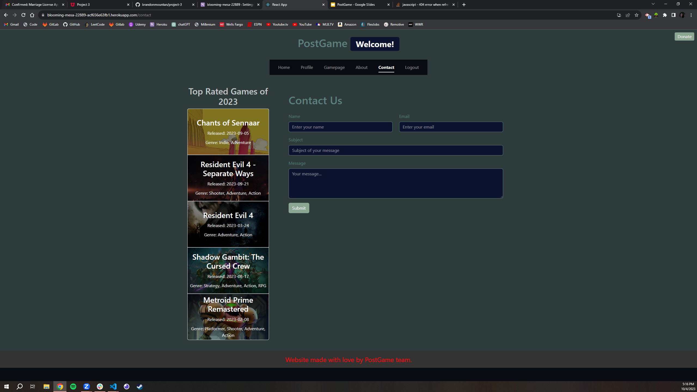

# PostGame

## Description

- What was your motivation?
- Why did you build this project? (Note: the answer is not "Because it was a homework assignment.")
- What problem does it solve?
- What did you learn?

The motivation behind building this project was to collaboratively build an impressive MERN Stack Single-Page Application. We wanted to reach out to individuals who play video games (gamers). Our goal was to build something that our users could use to sign up, build a profile of posts and liked games, and socialize with other gamers. With our platform, users can post or view other users posts about games they choose. This would also allow users to interact with other gamers that have similar interests.

This project incorporates much of what we have learned in this third and final unit of the course as well as the entire bootcamp. The technologies used in this project are modern and complex which is great for using as a showcase for job interviews. There was a lot of teamwork used in this project and it took a great effort from everybody to bring this application to life.

All of us who helped built this project seemed to fall into the expected users category. We all play games and related on the issue of not having a singular good resource for gaming. With our app, users would be able to build a unique profile where they can compile all of the data they find into one place. The many things users can do with their profile include 'like' or 'favorite' games, post about games, post videos, and add friends (other users). Our app can be described as a hybrid of a social media app and a blog app. Users can use it for one or the other or both. Our app includes data from an outside API called RAWG that we used on our game page and home page.

One of the most important learning opportunities within this app was creating our own API on the back end and using resolvers, typedefs, queries and mutations to display our own data on the front end. This application is built with React.

## Table of Contents

- [Installation](#installation)
- [Usage](#usage)
- [Technologies Used](#technologies-used)
- [Screenshots](#screenshots)
- [Credits](#credits)
- [License](#license)
- [Features](#features)
- [Future Implementations](#futureimplementations)
- [Link](#link)

## Installation

- Clone the repository to your computer.
- Navigate to the project directory
- run `npm run install`,`npm run seed`, `npm run start` then `npm run develop`

## Technologies Used

React

    Front-end Javascript library. React is based on components which are bits of code that can be resused. It is used to develop as single-page application (SPA). An SPA interacts with the user by dynamically rewriting the current web page with new data from the web server. This is in contrast to web browsers loading entire new pages.

React-router

    Used for page routing. Third party library that allows developers to define routes, manage navigation, and handle URL changes.

Node.js

    Open-source, cross-platform server environment. Used for the back-end and executes javascript code outside of the web browser. React and javascript get along very well.

Express.js

    Back-end web application blueprint for building RESTful APIs along with node.js.

MongoDB

    Cross-platform document-oriented database program. Classified as NoSQL. The documents are JSON-like because they have optional schemas.

JWT (JSON Web Token)

    Used for encryption. The payload, or intended message, holds JSON that asserts a number of claims, or identity information.

Bcrypt

    Password hashing function for users so their password is protected.

Graphql and Apollo Server

    Used to query and manipulate data for APIs.

React-Bootstrap (for styling)

## Screenshots

!
!
!
!
!

## Credits

[Brandon Mountan](https://github.com/brandonmountan)

[Daniel Wilson](https://github.com/Part-time-Dan)

[Reiley Burnitt](https://github.com/Reibean)

[Phillip Lam Thach](https://github.com/02madmax)

[Bridger Daw](https://github.com/gymbridger)

## License

## Features

- Able to create A profile
- Post game related content
- Search games
- Add friends
- A sidebar that displays the top rated games of 2023

## Future Implementations
- Be able to accept or deny a friend request

## Link
